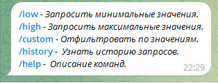

# Инструкция телеграм-бота.
## Краткое описание:
Бот даёт возможность оставаясь у себя дома, просмотреть отели по всему миру,
отсортировать и фильтровать по вашему желанию.

### Инструкция по эксплуатации:
Для начальной настройки бота, Вам необходимо создать виртуальное окружение. 
Поместить токен-бота и API-ключ rapidapi.com в переменные окружения (Файл .env). 
Далее запускаем бота в файле main.py. Для отслеживания функционирования бота и возможных ошибок,
ведётся логгирование, путём записи данных в файлы. logs/info.log - записывает всю информацию,
которая логируется в боте. logs/error.log - записывает только возникшие исключения. 
Параметры логгирования можно изменить в файле utils/logging.py. 
По умолчанию в конфигурации логгера, логи хранятся не более 24 часов.

Команды бота:

    /start - Запуск бота
    /help — помощь по командам бота,
    /lowprice — запросить минимальные значения,
    /highprice — запросить максимальные значения,
    /custom — отфильтровать по значениям.
    /history — вывод истории поиска отелей


### Запуск на Windows (при установленном python):
Открываем терминал, переходим в корневую папку с ботом
1. Создаём окружение ```python -m venv venv```
2. Активируем окружение ```venv\Scripts\activate.bat```
3. Устанавливаем зависимости ```FOR /F %x IN (requirements.txt) DO ( IF NOT # == %x ( pip install %x ) )```
4. Переименовываем файл .env.template в .env . Заполняем поля токен-бота и API-ключ rapidapi.com
5. Вводим токен-бота и API-ключ rapidapi.com
6. Запускаем командой из терминала ```python main.py```

### Запуск на Linux (при установленном python):
Открываем терминал, переходим в корневую папку с ботом
1. Создаём окружение ```python3 -m venv venv```   
2. Активируем окружение source ```source venv/bin/activate```
3. Устанавливаем зависимости ```pip install -r requirements.txt```
4. Переименовываем файл .env.template в .env . Заполняем поля токен-бота и API-ключ rapidapi.com
5. Вводим токен-бота и API-ключ rapidapi.com
6. Запускаем командой из терминала ```python3 main.py```


После запуска переходим в телеграм, ищем в контактах наш новый бот и запускаем его командой
/start.
Перед нами появилось сообщение.



Рассмотрим 1 из команд, например /custom.
Выбираем, нажимаем, видим.


Вводим страну, либо можно выбрать из предложенных.
Выбрали например -> AMERICA.
Далее необходимо написать или выбрать округ, город.


Пишем город -> Angeles.
После нужно выбрать район.


Выбираем -> Hollywood.
Вводим сколько отелей отобразить, например -> 3.


Выбираем фильтрацию -> Питание.


Питание -> Всё включено
И получаем результат


## Перечень файлов проекта
### Файлы в корне проекта:

    .env.template - образец файла .env с описанием данных.
    .env - необходимо создать вручную и поместить Токен телеграм-бота и API-ключ (rapidapi.com).
    loader.py - создаёт экземпляры: телеграмм-бота и логгера.
    main.py - запускает бота и создаёт базу данных, в случае её отсутствия
    readme.md - инструкция по эксплуатации телеграмм-бота
    reqirements.txt - хранит в себе стороние зависимости проекта

### Пакеты в корне проекта:
1. api_requests:


    init.py - инициализирует пакет api_requests и его содержимое
    get_meta_data.py - содержит все эндпоинты делающие запросы к API


2. config_data:


    init.py - инициализирует пакет config_data и его содержимое
    config.py - подгружает переменные окружения, для работы бота и хранит параметры для запроса к API rapidapi.com


3. database:


    init.py - инициализирует пакет database и его содержимое
    database.db - база данных sqlite. В случае отсутствия в проекте, запустите телеграм-бота.
    database.py - содержит все функции по работе с базой данной


4. handlers:


    init.py - инициализирует пакет handlers и его содержимое 
    custom_handlers:
        init.py - инициализирует пакет custom_handlers и его содержимое
        back_main_menu.py - модуль обработки каллбэка с датой main_menu
        del_history.py - модуль обработки каллбэка с датой del_history
        filter_amenities.py - модуль фильтра особенности отелей
        filter_lodging.py - модуль фильтра вида жилья
        filter_mael_plan.py - модуль фильтра рациона питания
        filter_price.py - модуль фильтра по ценовому диапазону
        filter_star.py - модуль фильтра по звёздности отеля
        handler_cmd_custom.py - модуль обработки состояния method_sort_custom
        handler_cmd_high.py - модуль обработки состояния method_sort_high
        handler_cmd_low.py - модуль обработки состояния method_sort_low
        show_history.py - модуль отображения истории запросов пользователей
        survey.py - модуль команд "low", "high", "custom"
    default_handlers:
        init.py - инициализирует пакет default_handlers и его содержимое
        help.py - Модуль обработки команды 'help' 
        start.py - Модуль обработки команды 'start'

5. images_readme - в папке хранятся картинки для readme.md


6. keyboards:

    init.py - инициализирует пакет keyboards и его содержимое

    inline:

        init.py - инициализирует пакет inline и его содержимое
        del_history.py - модуль создания клавиатуры "удалить история запросов"
        main_menu.py - модуль создания клавиатуры "главное меню"
    reply:

        init.py - инициализирует пакет reply и его содержимое
        list_button.py - модуль генерации клавиатуры. Имя берётся из входящего списка


7. logs:


    err.log - храниться лог с ошибками
    info.log - хранит информационный лог


8. states:


    init.py - инициализирует пакет states и его содержимое
    contact_information.py - модуль хранения данных (состояний) пользователя


9. utils:


    init.py - инициализирует пакет utils и его содержимое
    logging.py - модуль логгера. Записывает лог с ошибками в ./logs/err.log, информационный лог в ./logs/info.log.
    misc:
        init.py - инициализирует пакет misc и его содержимое